<div align="center">
  
  
  [](https://opensource.org/licenses/MIT)
  [](https://www.python.org/downloads/)
  [](https://www.docker.com/)
  [](https://cloud.google.com/run)
</div>


A production-ready Hybrid Retrieval-Augmented Generation (RAG) system designed for Cisco network automation certification preparation. This system combines local document search, web search, and AI generation to provide comprehensive, source-backed answers for:

- [CCNA Automation](https://learningnetwork.cisco.com/s/ccnaauto-exam-topics)
- [CCNP Automation](https://learningcontent.cisco.com/documents/marketing/exam-topics/350-901-AUTOCOR-v2.0-7-9-2025.pdf)
- [CCIE Automation](https://learningcontent.cisco.com/documents/marketing/exam-topics/CCIE_Automation_V1.1_BP.pdf)
- [Automating Cisco Enterprise Solutions (ENAUTO)](https://www.cisco.com/site/us/en/learn/training-certifications/exams/enauto.html)
- [Automating Cisco Data Center Networking Solutions (DCNAUTO)](https://learningcontent.cisco.com/documents/marketing/exam-topics/300-635-DCNAUTO-v2.0-7-9-2025.pdf)
- [DevNet Associate](https://learningnetwork.cisco.com/s/devnet-associate-exam-topics)
- [DevNet Professional (DEVCOR)](https://learningnetwork.cisco.com/s/devcor-exam-topics)

## 🚀 Current Status

**✅ FULLY OPERATIONAL** - The system is currently deployed and working perfectly at:

**🌐 Live Demo:** http://cs.co/automation-certification-station

**Recent Updates (August 2025):**
- 🚀 **Migrated to FastAPI**: Replaced Streamlit with a lightweight FastAPI implementation
- ⚡ **Improved Performance**: Faster response times with optimized model loading
- 🏗️ **Simplified Architecture**: Single-process design for better reliability
- 📱 **Enhanced Mobile Experience**: Fully responsive design with improved touch support
- 🔒 **Better Security**: Reduced attack surface with minimal dependencies

**Key Features:**
- 🤖 **AI Chat Interface**: FastAPI-based professional UI with Cisco branding
- 📚 **Document Search**: 11 official Cisco PDFs + curated URLs in knowledge base
- 🔍 **Web Search**: Real-time SerpAPI integration for latest information
- ⚡ **Fast Responses**: Optimized response times with parallel processing
- 💬 **Conversation Context**: Maintains chat history and context
- 🎯 **Exam-Specific Guidance**: Detailed study plans based on official blueprints
- 🔗 **Resource Links**: Verified, clickable resource links
- 📱 **Mobile First**: Fully responsive design for all devices

## What This System Does

This application serves as an intelligent certification advisor that:

- **Processes Official Documentation**: Ingests 10+ official Cisco certification PDFs and URLs
- **Provides Expert Guidance**: Answers technical questions with specific exam topics and study plans
- **Combines Multiple Sources**: Uses both local document search and real-time web search
- **Delivers Fast Responses**: Optimized with parallel processing and efficient AI models
- **Offers Professional Interface**: Clean web UI with Cisco branding and responsive design

## System Architecture

### Hybrid RAG Architecture Overview

```mermaid
flowchart TD
    A[👤 User Query] --> B{🧠 FastAPI Server}
    
    B -->|Loads| C[📱 Responsive UI]
    B -->|Handles| D[🔍 Hybrid RAG Pipeline]
    
    D --> E[📚 Document Search]
    D --> F[🌐 Web Search]
    
    E --> G[(🗂️ FAISS Vector Store<br/>209 Chunks)]
    F --> H[🔎 SerpAPI<br/>Real-time Results]
    
    G --> I[🔗 Context Fusion]
    H --> I
    
    I --> J[🤖 Google Gemini 1.5 Flash]
    
    J --> K[📋 Comprehensive Response]
    
    style A fill:#e1f5fe
    style B fill:#e8f5e9
    style C fill:#e3f2fd
    style D fill:#f3e5f5
    style J fill:#e8f5e8
    style K fill:#fff8e1
```



### System Components Architecture

```mermaid
graph TB
    subgraph "🖥️ Frontend Layer"
        UI[FastAPI Web Interface<br/>• Chat History<br/>• Cisco Theme<br/>• Responsive Design]
    end
    
    subgraph "⚙️ API Layer"
        API[FastAPI Endpoints<br/>• WebSocket Chat<br/>• Static Files<br/>• Health Checks]
    end
    
    subgraph "🤖 AI & Data Layer"
        RAG[Hybrid RAG Engine<br/>• Document Search<br/>• Web Search<br/>• Context Fusion]
        GEMINI[Google Gemini 1.5 Flash<br/>• Text Generation<br/>• Fast Response]
        SERP[SerpAPI<br/>• Real-time Search]
    end
    
    subgraph "💾 Storage Layer"
        VECTOR[(FAISS Vector Store<br/>• 384-dim Embeddings<br/>• Fast Similarity Search)]
        DOCS[(Document Collection<br/>• 11 Cisco PDFs<br/>• 9 Official URLs)]
    end
    
    UI --> API
    API --> RAG
    RAG --> GEMINI
    RAG --> SERP
    RAG --> VECTOR
    VECTOR --> DOCS
    
    style UI fill:#e3f2fd
    style API fill:#e8f5e9
    style RAG fill:#f3e5f5
    style GEMINI fill:#e8f5e8
    style VECTOR fill:#fce4ec
    style DOCS fill:#f1f8e9
```



### Document Processing Pipeline

The system processes documents through a sophisticated vectorization pipeline:

**📁 Data Sources:**
- 11 official Cisco certification PDFs (CCNA Auto, ENAUTO, DCNAUTO, AUTOCOR, CCIE materials)
- 9 curated Cisco URLs (Cisco U courses, Learning Network, DevNet resources)

**🔄 Processing Steps:**
1. **Content Extraction**: PyPDF2 for PDFs, BeautifulSoup4 for web content
2. **Text Chunking**: 500 characters per chunk with 50-character overlap for context preservation
3. **Embedding Generation**: paraphrase-MiniLM-L3-v2 model creates 384-dimensional vectors
4. **Vector Store Creation**: FAISS IndexFlatL2 for fast similarity search

**📊 Output:**
- `faiss.index` (321KB) - Vector similarity search index
- `texts.pkl` (101KB) - Text chunks and metadata
- 209 total chunks ready for sub-second query response

## Technical Components

The system is built using the following key technologies:

### Core Framework
- **Python 3.12**: Optimized for performance and modern async features
- **FastAPI**: High-performance web framework with automatic docs
- **Google Gemini 1.5 Flash**: Fast, efficient AI model for response generation
- **FAISS**: Facebook AI Similarity Search for efficient vector operations
- **Sentence Transformers**: State-of-the-art text embedding models
- **WebSockets**: Real-time bidirectional communication
- **Jinja2**: Templating engine for dynamic HTML generation

### Document Processing
- **PyPDF2**: PDF text extraction and metadata handling
- **BeautifulSoup4**: Web content scraping and HTML parsing
- **Requests**: HTTP client for web content retrieval

### Search and Retrieval
- **SerpAPI**: Real-time Google search integration (optional)
- **Concurrent.futures**: Parallel processing for faster response times
- **Pickle**: Efficient serialization for text chunk storage

### Deployment
- **Docker**: Lightweight containerization
- **Google Cloud Run**: Serverless container platform with auto-scaling
- **Multi-stage Builds**: Optimized container images
- **Health Checks**: Automatic monitoring and recovery
- **Environment Variables**: Secure configuration management

## Prerequisites

Before setting up this system, ensure you have:

- **Python 3.12**: Required for optimal performance
- **Docker**: For containerized deployment
- **Google Cloud SDK**: If deploying to Google Cloud Run
- **Google API Key**: Free from Google AI Studio for Gemini API access
- **SerpAPI Key**: Optional for web search integration (free tier available)
- **Git**: For version control and cloning the repository

## Step-by-Step Setup Instructions

### Step 1: Clone the Repository

```bash
# Clone the repository
git clone https://github.com/xanderstevenson/cisco-automation-certification-station.git
cd cisco-automation-certification-station
```

**⚠️ Important for Contributors**: If you plan to push changes after cloning, you'll need to increase Git's file size limit due to the vector store files:

```bash
# Increase Git's HTTP post buffer size to handle large files
git config http.postBuffer 524288000

# This prevents "HTTP 400" errors when pushing commits with vector store files
# The FAISS index and text files are ~400KB total and may exceed default limits
```

### Step 2: Set Up with Docker

```bash
# Build the Docker image
docker build -t cisco-automation -f Dockerfile.fastapi .

# Run locally
docker run -p 8080:8080 -e GOOGLE_API_KEY=your_key_here cisco-automation
```

Or for development with live reload:

```bash
# Install dependencies
pip install -r requirements.txt

# Run with auto-reload
uvicorn fastapi_only:app --reload --host 0.0.0.0 --port 8080
```
# Install UV if not already installed
curl -LsSf https://astral.sh/uv/install.sh | sh

# Create virtual environment with Python 3.12
uv venv --python 3.12
source .venv/bin/activate  # On Windows: .venv\Scripts\activate

# Install dependencies
uv pip install -r requirements.txt
```

**Option B: Using Standard pip**
```bash
# Create virtual environment with Python 3.12
python3.12 -m venv .venv
source .venv/bin/activate  # On Windows: .venv\Scripts\activate

# Upgrade pip and install dependencies
pip install --upgrade pip
pip install -r requirements.txt
```

### Step 3: Obtain API Keys

**Google Gemini API Key (Required)**

1. Visit [Google AI Studio](https://aistudio.google.com/)
2. Sign in with your Google account
3. Click "Get API Key" → "Create API Key"
4. Copy the generated API key

**SerpAPI Key (Optional - for web search)**

1. Visit [SerpAPI](https://serpapi.com/)
2. Sign up for a free account (100 searches/month)
3. Navigate to your dashboard
4. Copy your API key

### Step 4: Configure Environment Variables

```bash
# Create .env file in the project root
touch .env

# Add your API keys to .env file
echo "GOOGLE_API_KEY=your_google_api_key_here" >> .env
echo "SERPAPI_KEY=your_serpapi_key_here" >> .env  # Optional
echo "EMBEDDING_MODEL=paraphrase-MiniLM-L3-v2" >> .env
echo "PYTHONUNBUFFERED=1" >> .env
echo "TOKENIZERS_PARALLELISM=false" >> .env
```

**Example .env file:**
```env
GOOGLE_API_KEY=your_google_gemini_api_key_here
SERPAPI_KEY=your_serpapi_key_here
EMBEDDING_MODEL=paraphrase-MiniLM-L3-v2
PYTHONUNBUFFERED=1
TOKENIZERS_PARALLELISM=false
```

### Step 5: Build the Knowledge Base

```bash
# Process documents and create vector embeddings
python vectorize.py
```

**What this does:**

- Loads 10 Cisco certification PDFs from the `docs/` directory
- Fetches content from 9 official Cisco URLs listed in `urls.txt`
- Chunks all content into 209 text segments (500 chars each, 50 char overlap)
- Creates vector embeddings using the paraphrase-MiniLM-L3-v2 model
- Builds FAISS index for fast similarity search
- Saves index files to `rag/index/` directory

**Expected output:**

```text
Loading documents from docs/...
Processed 10 PDF files
Fetching content from URLs...
Processed 9 web URLs
Creating text chunks...
Generated 209 text chunks
Building vector embeddings...
Created FAISS index with 209 vectors
Saved to rag/index/faiss.index (321KB)
Saved to rag/index/texts.pkl (101KB)
Vectorization complete!
```

### Step 6: Run the Application

**Option A: Web Interface (Recommended)**
```bash
# Start the Streamlit web interface
streamlit run streamlit_app.py
```

The application will start at `http://localhost:8501`

**Option B: Command Line Interface**
```bash
# Run the command-line version
python hybrid_rag_gpt.py
```

### Step 7: Test the System

Try these sample queries to verify everything is working:

**Casual Interaction:**
```
User: Hi
Expected: Brief greeting and offer to help with Cisco certifications
```

**Technical Questions:**
```
User: When will DevNet certifications be retired?
Expected: Detailed response with February 3, 2026 date and context

User: How do I prepare for CCNA Automation?
Expected: Comprehensive study plan with specific exam topics and Cisco U links

User: What's the difference between NETCONF and RESTCONF?
Expected: Technical comparison with protocol details and use cases
```

## Project Structure

```
cisco-automation-certification-station/
├── README.md                    # This comprehensive guide
├── requirements.txt             # Python dependencies
├── requirements-lite.txt        # Memory-optimized dependencies for deployment
├── .env                         # Environment variables (create this)
├── .gitignore                   # Git ignore rules
├── render.yaml                  # Render.com deployment configuration
├── Dockerfile                   # Docker containerization
├── deploy-gcp.sh               # Google Cloud Run deployment script
│
├── streamlit_app.py             # Streamlit web interface entry point
├── hybrid_rag_gpt.py           # Core RAG logic with Gemini integration
├── vectorize.py                # Document processing and embedding creation
├── urls.txt                    # Official Cisco URLs for knowledge base
│
├── docs/                       # Cisco certification PDFs (10 files)
│   ├── 200-901-CCNAAUTO_v.1.1.pdf
│   ├── Cisco-automation-certification-station.png
│   ├── Automation_Cert_badges_Current_Future.png
│   └── Cisco-automation-certification-station-light.png
│
├── rag/                      # RAG implementation
│   ├── __init__.py
│   ├── retriever.py         # Document retrieval logic
│   └── vector_store.py      # FAISS vector store implementation
│
├── requirements.txt          # Python dependencies
└── urls.txt                 # List of URLs for knowledge base
```

## Deployment Options

### Option 1: Google Cloud Run (Recommended for Production)

Google Cloud Run provides the best performance, scalability, and integration with the Google Gemini API.

**Quick Deploy:**
```bash
# Set your Google Cloud project
export PROJECT_ID="your-project-id"
gcloud config set project $PROJECT_ID

# Enable required APIs
gcloud services enable cloudbuild.googleapis.com run.googleapis.com

# Load environment variables (IMPORTANT: Required for proper API key configuration)
source .env

# Build and deploy in one command
gcloud builds submit --tag gcr.io/$PROJECT_ID/cisco-automation-chatbot
source .env && gcloud run deploy cisco-automation-certification-station \
  --image gcr.io/$PROJECT_ID/cisco-automation-chatbot \
  --region us-central1 \
  --allow-unauthenticated \
  --memory 2Gi \
  --cpu 2 \
  --timeout 900 \
  --set-env-vars GOOGLE_API_KEY=$GOOGLE_API_KEY,SERPAPI_KEY=$SERPAPI_KEY,EMBEDDING_MODEL=paraphrase-MiniLM-L3-v2,PYTHONUNBUFFERED=1,TOKENIZERS_PARALLELISM=false
```

**Features:**
- Auto-scaling from 0 to 10 instances based on demand
- 2GB memory allocation for AI models
- Pay-per-use pricing (~$0.05-0.50/month typical usage)
- Built-in HTTPS and global CDN
- Integrated logging and monitoring

### Option 2: Local Development

**For development and testing:**
```bash
# Activate virtual environment
source .venv/bin/activate

# Start the web interface
streamlit run streamlit_app.py

# Or run command-line version
python hybrid_rag_gpt.py
```

### Option 3: Render.com (Alternative)

**Note**: Render's free tier has memory limitations (512MB) that may cause issues with AI models.

```bash
# The project includes render.yaml for deployment
# 1. Fork this repository
# 2. Connect to Render.com
# 3. Add environment variables in dashboard:
#    - GOOGLE_API_KEY
#    - SERPAPI_KEY (optional)
# 4. Deploy
```

## Performance Characteristics

### Response Times
- **Casual greetings**: ~1-2 seconds (direct response)
- **Technical queries**: ~6-8 seconds (hybrid RAG pipeline)
- **Document search**: ~0.5 seconds (FAISS vector similarity)
- **Web search**: ~2-3 seconds (SerpAPI + parallel processing)
- **AI generation**: ~3-4 seconds (Gemini 1.5 Flash)

### Resource Usage
- **Memory**: ~450MB (with loaded models)
- **Storage**: ~50MB (vector store + dependencies)
- **CPU**: Minimal during idle, burst during query processing
- **Network**: ~1-2MB per query (including web search)

### Scalability
- **Concurrent users**: 10-50 (depending on deployment)
- **Query throughput**: ~10-20 queries/minute per instance
- **Knowledge base**: Supports 1000+ documents with current architecture
- **Response quality**: Maintains consistency across scale

## Troubleshooting

### Common Issues and Solutions

**1. NumPy Compatibility Error**
```bash
# Error: numpy version incompatible with PyTorch
# Solution: Ensure Python 3.12 and NumPy < 2.0
python --version  # Should show 3.12.x
pip install "numpy<2.0"
```

**2. API Key Not Found**
```bash
# Error: GOOGLE_API_KEY not found
# Solution: Check .env file format
cat .env
# Should show: GOOGLE_API_KEY=your_key_here (no quotes, no spaces)
```

**3. FAISS Loading Issues**
```bash
# Error: could not open faiss.index for reading
# Solution: Rebuild vector store
rm -rf rag/index/
python vectorize.py
```

**4. Conda Environment Conflicts**
```bash
# Error: conda interfering with virtual environment
# Solution: Disable conda auto-activation
conda config --set auto_activate_base false
# Restart terminal and recreate virtual environment
```

**5. Memory Issues During Deployment**
```bash
# Error: Out of memory during Docker build
# Solution: Use requirements-lite.txt for deployment
cp requirements-lite.txt requirements.txt
# Or increase deployment memory allocation
```

**6. Slow Response Times**
```bash
# Issue: Responses taking >15 seconds
# Solutions:
# 1. Check internet connection for web search
# 2. Verify SERPAPI_KEY is valid
# 3. Monitor system resources
# 4. Consider disabling web search for faster responses
```

**7. PDF Processing Errors**
```bash
# Error: Cannot extract text from PDF
# Solution: Ensure PDFs are text-based (not scanned images)
# Check PDF file integrity:
python -c "import PyPDF2; print('PDF library working')"
```

### Debug Mode

Enable detailed logging for troubleshooting:

```bash
# Add to .env file
echo "DEBUG=true" >> .env
echo "PYTHONUNBUFFERED=1" >> .env

# Run with verbose output
python hybrid_rag_gpt.py
```

### Getting Help

1. **Check logs**: Look for error messages in terminal output
2. **Verify setup**: Ensure all prerequisites are installed
3. **Test components**: Run vectorization and API calls separately
4. **Check resources**: Monitor memory and CPU usage
5. **Update dependencies**: Ensure all packages are current versions

## Customization Guide

### Adding New Documents

```bash
# 1. Add PDFs to docs/ directory
cp your-new-cert.pdf docs/

# 2. Add URLs to urls.txt
echo "https://cisco.com/your-new-resource" >> urls.txt

# 3. Rebuild vector store
python vectorize.py
```

### Modifying AI Behavior

Edit the system prompt in `hybrid_rag_gpt.py`:

```python
system_prompt = """
You are a helpful AI assistant specialized in [YOUR DOMAIN].

**Your expertise includes:**
- [Topic 1]
- [Topic 2]
- [Topic 3]

**Communication style:**
- [Your preferred style]
- [Response format]

**Learning Resource Recommendations:**
1. [Primary resource]
2. [Secondary resource]
3. [Tertiary resource]
"""
```

### Changing Embedding Model

In `rag/vector_store.py`:

```python
# Options: paraphrase-MiniLM-L3-v2 (fast, 384-dim)
#          all-MiniLM-L6-v2 (balanced, 384-dim)
#          all-mpnet-base-v2 (best quality, 768-dim)
model = SentenceTransformer("your-preferred-model")
```

### UI Customization

Modify `public/cisco-theme.css` for custom branding:

```css
:root {
  --primary-color: #your-brand-color;
  --secondary-color: #your-accent-color;
}
```

## Contributing

Contributions are welcome! Please follow these steps:

```bash
# 1. Fork the repository
git clone https://github.com/your-username/cisco-automation-certification-station.git

# 2. Create feature branch
git checkout -b feature/amazing-feature

# 3. Make changes and test
python vectorize.py  # Test document processing
streamlit run streamlit_app.py  # Test web interface

# 4. Commit changes
git add .
git commit -m "Add amazing feature: detailed description"

# 5. Push and create pull request
git push origin feature/amazing-feature
```

## Alternative Deployment Options

This repository includes configuration files for multiple deployment platforms to provide flexibility for different use cases:

### Chainlit Interface
- **Files**: `app.py`, `chainlit.md`, `.chainlit/config.toml`
- **Use Case**: Alternative chat interface with different UI/UX
- **Deployment**: Run `chainlit run app.py` for local development
- **Features**: Built-in chat interface, different theming options

### Render.com Deployment
- **Files**: `render.yaml`, `requirements-lite.txt`
- **Use Case**: Free tier deployment with memory optimizations
- **Limitations**: 512MB memory limit, may require performance trade-offs
- **Setup**: Connect repository to Render.com and deploy using `render.yaml`

### Docker Legacy Support
- **Files**: `Dockerfile` (original), `requirements.txt`
- **Use Case**: Custom containerized deployments
- **Note**: `Dockerfile.streamlit` is recommended for production

### Why Multiple Options?

These alternative configurations are maintained to:
- Support different deployment preferences
- Provide fallback options if primary deployment fails
- Enable community contributions across different platforms
- Demonstrate platform-agnostic architecture

**Recommendation**: Use Streamlit + Google Cloud Run for production deployments, but feel free to explore alternatives based on your specific needs.

## License

This project is licensed under the MIT License - see the LICENSE file for details.

## Acknowledgments

- **Google Gemini**: Fast, free AI model for response generation
- **Cisco**: Comprehensive certification documentation and learning resources
- **Streamlit**: Modern chat interface framework
- **FAISS**: Efficient vector similarity search
- **Sentence Transformers**: State-of-the-art text embedding models
- **Open Source Community**: For the excellent tools and libraries that make this possible

---

**Built for the Cisco certification community**

*This project demonstrates how to build production-ready RAG systems using free, open-source tools and APIs. It serves as both a practical certification study tool and a technical reference for implementing hybrid RAG architectures.*
